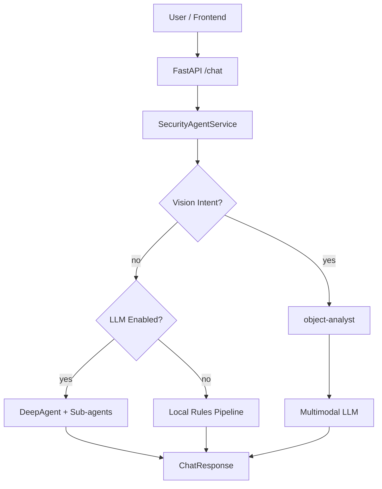

# Security DeepAgent

面向安防场景的轻量化 DeepAgents 本地生产系统。项目基于 FastAPI、SQLite、Markdown 知识库和 React 前端，支持从问答、知识检索、设备告警查询、人工确认到图片物品研判的完整闭环，适合在个人工作站上部署、演示和二次开发。

## 功能概览

| 模块 | 能力 |
|------|------|
| 智能问答 | 设备接入排障、告警分析、部署问题、知识库问答 |
| DeepAgent | 启用 LLM 后使用 `create_deep_agent` 编排工具与子 Agent |
| 本地兜底链路 | 无 LLM 时仍可走规则 + 检索 + SQLite 查询完成演示 |
| 安防物品研判 | 主 Agent 识别意图后委派 `object-analyst`，调用多模态 API 识图 |
| Skills | 运行时加载 `skills/*/SKILL.md`，注入 Agent 系统提示词 |
| Sub-agents | YAML 配置研究、排障、告警、物品研判等子 Agent |
| 风险控制 | 高风险关键词触发人工确认，前端展示待确认动作与原因 |
| 前端工作台 | 聊天、证据、轨迹、任务、审核、设备/告警概览、图片上传 |

## 架构

```text
用户请求 / 前端工作台
        │
        ▼
 SecurityAgentService
        │
        ├─ 图片/物品研判意图 ──► object-analyst ──► analyze_security_object ──► 多模态 API
        │
        ├─ DeepAgent 链路 ─────► create_deep_agent ──► 工具 / 子 Agent / Skills
        │
        └─ 本地规则链路 ───────► 知识库 + 设备 + 告警 + 任务清单
```



## 目录结构

```text
security-deepagent-practice/
├── config/
│   ├── subagents.yaml          # 子 Agent 配置
│   └── settings.yaml           # 系统配置
├── data/
│   ├── db/                     # SQLite
│   ├── knowledge/              # 本地知识库 Markdown
│   ├── logs/                   # 审计日志
│   ├── memory/                 # 会话摘要
│   └── workspace/              # Agent 可写目录 / 图片上传
├── docs/
│   ├── design.md
│   └── sandbox_qa.md
├── frontend/                   # React + TypeScript + Vite 前端
├── scripts/
│   ├── init_db.py
│   ├── run_cli.py
│   └── verify_skills.py
├── skills/                     # 运行时 Agent Skills
├── src/security_agent/         # 后端核心代码
├── .env.example
└── requirements.txt
```

## 环境要求

- Python 3.10+
- Node.js 20+（前端开发/构建）
- 可选：OpenAI 兼容 LLM 服务（文本 Agent）
- 可选：OpenAI 兼容多模态 API（物品研判）

## 快速开始

### 1. 安装后端

```bash
cd security-deepagent-practice

# 建议使用虚拟环境
python -m venv .venv
source .venv/bin/activate

pip install -r requirements.txt
pip install -e .
cp .env.example .env
python scripts/init_db.py
```

> 必须执行 `pip install -e .`，否则运行 `uvicorn security_agent.app:app` 会出现 `ModuleNotFoundError: No module named 'security_agent'`。

### 2. 启动后端

```bash
uvicorn security_agent.app:app --host 0.0.0.0 --port 8015
```

健康检查：

```bash
curl http://127.0.0.1:8015/health
```

### 3. 安装并启动前端

```bash
cd frontend
npm install
cp .env.example .env
npm run dev
```

- 前端地址：`http://127.0.0.1:5173`
- 后端地址：通过 `frontend/.env` 中 `VITE_API_BASE_URL=http://127.0.0.1:8015` 配置

生产构建：

```bash
cd frontend
npm run build
npm run preview
```

## 运行模式

系统支持三种主要执行链路：

### 1. 本地规则链路（默认）

`.env` 中保持：

```bash
SECURITY_AGENT_LLM_ENABLED=false
```

特点：

- 不依赖大模型，适合本地演示和 CI 测试
- 自动检索知识库、查询设备/告警、生成排查任务
- 回答中会包含“已按本地生产链路完成初步分析”

### 2. DeepAgent + LLM 链路

```bash
SECURITY_AGENT_LLM_ENABLED=true
OPENAI_API_KEY=your-api-key
OPENAI_BASE_URL=https://dashscope.aliyuncs.com/compatible-mode/v1
SECURITY_AGENT_MODEL=qwen-plus
```

特点：

- 使用 `create_deep_agent` 编排工具与子 Agent
- 加载 Skills 与 YAML 子 Agent 配置
- 若调用失败，会自动降级到本地规则链路

### 3. 安防物品研判链路

```bash
SECURITY_AGENT_VISION_ENABLED=true
SECURITY_AGENT_VISION_MODEL=qwen-vl-plus
SECURITY_AGENT_VISION_API_KEY=your-api-key
SECURITY_AGENT_VISION_BASE_URL=https://dashscope.aliyuncs.com/compatible-mode/v1
```

触发条件：

- 请求携带 `image_path` / `image_url` / `image_base64`
- 或文本命中“图片、识别、研判、抓拍、物品、识图”等关键词

流程：

1. 主 Agent 识别为物品研判意图
2. 委派 `object-analyst` 子 Agent
3. 调用 `analyze_security_object` 工具
4. 请求多模态 API 并返回研判结论

## 配置说明

复制 `.env.example` 为 `.env` 后，可按需修改：

| 变量 | 说明 | 默认值 |
|------|------|--------|
| `SECURITY_AGENT_LLM_ENABLED` | 是否启用文本 LLM / DeepAgent | `false` |
| `SECURITY_AGENT_MODEL` | 文本模型名称 | `qwen-plus` |
| `OPENAI_API_KEY` | 文本 LLM API Key | 空 |
| `OPENAI_BASE_URL` | 文本 LLM Base URL | `http://127.0.0.1:8000/v1` |
| `SECURITY_AGENT_VISION_ENABLED` | 是否启用多模态物品研判 | `false` |
| `SECURITY_AGENT_VISION_MODEL` | 多模态模型名称 | `qwen-vl-plus` |
| `SECURITY_AGENT_VISION_API_KEY` | 多模态 API Key，默认可回退到 `OPENAI_API_KEY` | 空 |
| `SECURITY_AGENT_VISION_BASE_URL` | 多模态 Base URL，默认可回退到 `OPENAI_BASE_URL` | 空 |
| `SECURITY_AGENT_SKILLS_ENABLED` | 是否加载 Skills | `true` |
| `SECURITY_AGENT_SKILLS_DIR` | Skills 目录 | `skills` |
| `SECURITY_AGENT_SANDBOX_PROVIDER` | 沙箱类型：`local` / `opensandbox` | `local` |
| `SECURITY_AGENT_ALLOW_SHELL` | 是否允许 shell | `false` |
| `SECURITY_AGENT_PORT` | API 端口 | `8015` |

## Skills 与子 Agent

### Skills

运行时由 `skills.py` 扫描并注入系统提示词：

| Skill | 用途 |
|-------|------|
| `skills/research/SKILL.md` | 资料检索、证据整理、报告生成 |
| `skills/system-info/SKILL.md` | 部署排障、环境信息采集 |
| `skills/object-analysis/SKILL.md` | 图片识别、安防物品研判 |

验证 Skills 加载：

```bash
python scripts/verify_skills.py
```

### Sub-agents

配置位于 `config/subagents.yaml`：

| 子 Agent | 职责 |
|----------|------|
| `security-researcher` | 资料检索、证据整理 |
| `ops-troubleshooter` | 设备接入、部署排障 |
| `alarm-analyst` | 告警分析、误报排查 |
| `object-analyst` | 图片识别、物品研判 |

## 工具列表

| 工具 | 说明 |
|------|------|
| `search_security_knowledge` | 检索本地安防知识库 |
| `query_device_status` | 查询设备状态 |
| `query_alarm_events` | 查询告警事件 |
| `create_security_todos` | 生成排查任务清单 |
| `analyze_security_object` | 多模态图片识别 / 物品研判 |
| `request_human_review` | 创建人工确认请求 |

## API 接口

### 健康检查

```bash
GET /health
```

返回示例：

```json
{
  "status": "ok",
  "app": "security-deepagent-practice",
  "llm_enabled": true,
  "vision_enabled": true
}
```

### 对话

```bash
POST /chat
```

请求体：

```json
{
  "message": "仓库北门摄像头离线，帮我排查原因。",
  "thread_id": "local-test-1",
  "user_id": "ops_001",
  "image_path": "uploads/sample.jpg",
  "image_url": null,
  "image_base64": null
}
```

响应体主要字段：

| 字段 | 说明 |
|------|------|
| `answer` | 助手回答 |
| `react_trace` | ReAct 执行轨迹 |
| `evidence` | 知识库证据 |
| `tasks` | 排查任务 |
| `intent` | 识别到的业务意图 |
| `needs_review` | 是否需要人工确认 |
| `review_reason` | 审核触发原因 |
| `proposed_action` | 待确认动作 |
| `risk_keywords` | 命中的高风险关键词 |

### 图片研判示例

将图片放到 `data/workspace/uploads/sample.jpg`：

```bash
curl -X POST http://127.0.0.1:8015/chat \
  -H "Content-Type: application/json" \
  -d '{
    "message": "请识别这张抓拍图里的异常物品，并给出安防研判。",
    "thread_id": "vision-test-1",
    "user_id": "ops_001",
    "image_path": "uploads/sample.jpg"
  }'
```

前端可直接上传图片，后端通过 `image_base64` 接收。

### 其他接口

```bash
GET  /threads
GET  /threads/{thread_id}
GET  /reviews?status=pending
GET  /devices
GET  /alarms
POST /review/continue
```

人工确认示例：

```bash
curl -X POST http://127.0.0.1:8015/review/continue \
  -H "Content-Type: application/json" \
  -d '{
    "review_id": 1,
    "approve": true,
    "operator_id": "ops_001"
  }'
```

## 前端工作台

前端位于 `frontend/`，提供 4 个页面：

| 页面 | 功能 |
|------|------|
| 智能工作台 | 聊天、证据、ReAct 轨迹、任务、风险、图片上传 |
| 业务概览 | 设备与告警概览 |
| 历史会话 | 会话列表与消息详情 |
| 人工确认 | 待审核列表与批准/拒绝 |

前端会根据 `/health` 动态显示当前链路状态，例如：

- `本地生产链路`
- `DeepAgent 就绪`
- `DeepAgent + 大模型编排链路`
- `安防物品研判 / 图片识别`

## CLI 使用

```bash
python scripts/run_cli.py "仓库北门摄像头离线，帮我排查"
```

## 沙箱配置

默认使用本地轻量沙箱：

```bash
SECURITY_AGENT_SANDBOX_PROVIDER=local
SECURITY_AGENT_ALLOW_SHELL=false
```

`local` provider 会把 Agent 可写目录限制在 `data/workspace/`。

如需预留 OpenSandbox：

```bash
SECURITY_AGENT_SANDBOX_PROVIDER=opensandbox
SECURITY_AGENT_OPENSANDBOX_DOMAIN=http://your-opensandbox-host:8080
```

当前轻量版本仅提供 OpenSandbox 接入点，真实接入需补充 SDK 与 backend adapter。更多说明见 `docs/sandbox_qa.md`。

## 典型场景

### 设备离线排查

```bash
curl -X POST http://127.0.0.1:8015/chat \
  -H "Content-Type: application/json" \
  -d '{
    "message": "仓库北门摄像头离线，帮我根据知识库排查原因，并给出下一步建议。",
    "thread_id": "device-case-1",
    "user_id": "ops_001"
  }'
```

### 告警误报分析

```bash
curl -X POST http://127.0.0.1:8015/chat \
  -H "Content-Type: application/json" \
  -d '{
    "message": "布控告警频繁误报，可能是什么原因？",
    "thread_id": "alarm-case-1",
    "user_id": "ops_001"
  }'
```

### 高风险动作确认

当用户请求包含“重启、删除、修改配置、升级”等关键词时，系统会创建人工确认请求。前端 Risk Control 面板会展示：

- 待确认动作
- 触发原因
- 命中关键词

## 常见问题

### `ModuleNotFoundError: No module named 'security_agent'`

在项目根目录执行：

```bash
pip install -e .
```

### 前端 `tsc: not found`

```bash
cd frontend
npm install
```

### 前端构建失败（Vite 8 / Node 版本）

项目已固定为 Vite 5。若仍失败，建议：

```bash
cd frontend
rm -rf node_modules package-lock.json
npm install
npm run build
```

### 页面显示“本地生产链路”，但实际已启用 LLM

1. 检查 `/health` 中 `llm_enabled`
2. 修改 `.env` 后重启后端
3. 前端顶部状态会在发起对话后根据 `react_trace` 更新

### 图片研判提示未启用 vision

确认 `.env` 中：

```bash
SECURITY_AGENT_VISION_ENABLED=true
SECURITY_AGENT_VISION_API_KEY=...
SECURITY_AGENT_VISION_BASE_URL=...
```

并重启后端。

### 端口被占用

```bash
lsof -i :8015
```

或改用其他端口：

```bash
uvicorn security_agent.app:app --host 0.0.0.0 --port 8016
```

## 相关文档

- 设计文档：`docs/design.md`
- 沙箱说明：`docs/sandbox_qa.md`

## 开发说明

- 后端核心入口：`src/security_agent/agent.py`
- FastAPI 入口：`src/security_agent/app.py`
- 前端入口：`frontend/src/App.tsx`
- 新增 Skill：在 `skills/<name>/SKILL.md` 中添加 Markdown 与 frontmatter
- 新增子 Agent：编辑 `config/subagents.yaml` 并注册工具
